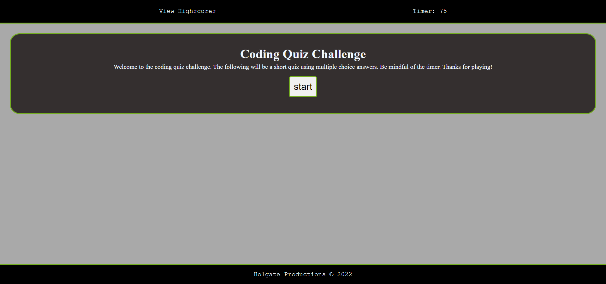

# Quiz-Game
A multiple choice quiz game

## Description

This is a quiz game that tests your knowloedge of Javascript terms. It's multiple choice and there are 5 questions. Once you finish the game it asks for your initials to record a score on the highscores page.

## Technologies Used

-HTML
-CSS
-Javescript

## Installation

1. Clone this repository to your computer's desktop.
2. Navigate to the top level directory.
3. Open the index.html file in a browser.

## Usage

## Link to Deployed Application and Repo

https://holgateb.github.io/quiz-game/

https://github.com/holgateb